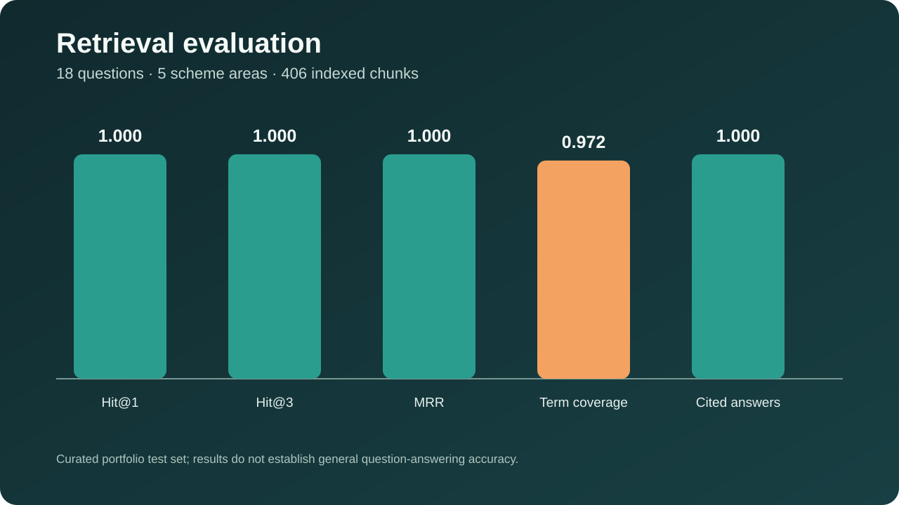

# KrishiGuide Scheme Assistant

A citation-grounded applied AI project for searching official information about major Indian farmer programmes. The assistant retrieves evidence from PM-KISAN, PMFBY, Soil Health Card, e-NAM, and RBI Kisan Credit Card sources, then assembles a short extractive answer with page-aware citations.

[](https://github.com/divyarachala1812/krishiguide-scheme-assistant/actions/workflows/ci.yml)
[](pyproject.toml)
[](reports/retrieval_evaluation.json)
[](LICENSE)

| Project detail | Value |
|---|---|
| Author | Divya Rachala |
| Domain | Indian agriculture and public schemes |
| Project type | Applied AI and natural-language information retrieval |
| Interface | Command line and versioned evaluation outputs |
| Knowledge base | 406 chunks from seven official source items |

**Quick navigation:** [Evaluation](#evaluation-result) · [Example](#example) · [Architecture](#architecture) · [Testing](#testing-and-reproducibility) · [PDF report](reports/KrishiGuide_Scheme_Assistant_Report.pdf)

## Problem, root cause and purpose

Official farmer scheme information is spread across ministry PDFs, programme pages, FAQs and circulars. A normal web search can return an outdated summary without showing the supporting passage. The root cause is not the absence of information, but the difficulty of locating the right official section and keeping its source visible.

I built this project to retrieve short evidence from a declared official source collection and return page aware citations. It helps a user navigate documents while keeping eligibility, amounts, deadlines and application decisions outside the system.

## Retrieval approach

The project is not a keyword lookup and does not hard-code answers. It builds a knowledge base from public documents, chunks the text, learns word- and character-level TF-IDF representations, combines two similarity spaces, expands common Hindi and Hinglish scheme terms, ranks evidence, and composes an answer from the most relevant supported sentences.

The design is intentionally extractive. For benefit amounts, eligibility, insurance, and credit information, a fluent unsupported answer is more harmful than a concise answer copied from a cited official passage.

## Schemes covered

| Topic | Official material |
|---|---|
| PM-KISAN | Revised operational guidelines |
| PMFBY crop insurance | Revised operational guidelines |
| Soil Health Card | Three official FAQ pages covering issue cycle, parameters, and sampling |
| e-NAM | Government of India explainer |
| Kisan Credit Card | Reserve Bank of India master circular |

Source versions, publishers, and URLs are recorded in [`data/sources/source_manifest.json`](data/sources/source_manifest.json).

## Evaluation result

The curated test set contains 18 questions across all five topics, including two Hindi questions and one Hinglish question.

| Retrieval metric | Result |
|---|---:|
| Hit@1 | **1.000** |
| Hit@3 | **1.000** |
| Mean reciprocal rank | **1.000** |
| Expected-term coverage@3 | **0.972** |
| Answers with at least one citation | **100%** |



The report includes five separate experiments covering aggregate retrieval, question-level term coverage, source coverage, citation completeness, and Hindi or Hinglish stress checks.

These results measure retrieval on a small declared test set. They do not prove that the assistant can answer every farmer scheme question, understand every Indian language, or provide current eligibility advice.

## Example

```text
$ uv run python -m schemeguide.cli \
    "How often does a farmer receive a Soil Health Card?"

The indexed official sources state:
- It will be made available once in a cycle of 3 years ... [1]
- The SHC given in the next cycle of 3 years will be able to record changes ... [1]

Verify current eligibility, amounts, deadlines, and application steps on the
linked official portal before acting.

Sources:
[1] Soil Health Card FAQ: issue cycle
    https://support.soilhealth.dac.gov.in/kb/faq.php?id=40
```

## Architecture

```text
Official PDFs and webpages
          │
          ▼
Download + checksum + text extraction
          │
          ▼
Page-aware overlapping chunks
          │
          ├──────────────┐
          ▼              ▼
Word TF-IDF       Character TF-IDF
          └──────┬───────┘
                 ▼
      Weighted hybrid ranking
                 │
                 ▼
 Relevant-sentence selection
                 │
                 ▼
 Answer + official citations + verification warning
```

## Testing and reproducibility

| Quality gate | Latest verified result | Purpose |
|---|---:|---|
| Retrieval evaluation | **18 questions passed at Hit@1** | Expected official source ranks first |
| Citation contract | **100% cited answers** | Every evaluated answer contains evidence metadata |
| Expected-term coverage@3 | **0.972** | Retrieved passages cover declared answer concepts |
| Python tests | **6 passed** | Chunking, query expansion, evidence cleanup, and repository contracts |
| Ruff linting | **Passed** | Imports, correctness rules, and code consistency |
| Continuous integration | **Automated** | [GitHub Actions workflow](.github/workflows/ci.yml) |

Rebuild the corpus, evaluation report, README visual, and test evidence with:

```bash
uv sync
uv run python scripts/build_knowledge_base.py
uv run python scripts/evaluate_retrieval.py
uv run python scripts/demo_queries.py
uv run python scripts/create_readme_figure.py
uv run python scripts/build_report.py
uv run pytest -q
uv run ruff check .
```

Ask a question after building the knowledge base:

```bash
uv run python -m schemeguide.cli "What is the purpose of a Kisan Credit Card?"
uv run python -m schemeguide.cli "फसल बीमा में खरीफ प्रीमियम कितना है?"
```

## Repository structure

```text
data/sources/          Versioned official-source manifest
data/evaluation/       Declared retrieval questions and expected sources
data/raw/              Downloaded source files (local and ignored)
data/processed/        Extracted chunks and acquisition checksums (local and ignored)
docs/                  Architecture, evaluation, safety, and project report
models/                Rebuilt hybrid retrieval index (local and ignored)
reports/               Evaluation metrics and sample citation-grounded answers
scripts/               Build, evaluate, and demo entry points
src/schemeguide/       Ingestion, retrieval, answer, evaluation, and CLI package
tests/                 Helper and repository contract tests
```

The [research-style project report (PDF)](reports/KrishiGuide_Scheme_Assistant_Report.pdf) explains the abstract, problem, official source provenance, retrieval design, five experiments, safety boundary, limitations and conclusion.

## What the project demonstrates

- official-source acquisition and checksum tracking;
- PDF and HTML text extraction;
- page-aware chunking;
- hybrid lexical retrieval;
- lightweight Hindi and Hinglish query expansion;
- source ranking, extractive answer composition, and citations;
- retrieval evaluation with Hit@k, MRR, and content coverage;
- explicit safety and freshness boundaries;
- reproducible packaging, tests, and documentation.

## Safety boundary

This assistant is an educational navigation tool. It does not decide eligibility, submit applications, recommend loans or insurance, interpret law, or replace the latest scheme portal. Government programmes change; every answer ends with a reminder to verify current amounts, dates, and rules at the cited official source.

## Licence

Project code is licensed under MIT. Downloaded documents remain subject to the terms of their official publishers and are not committed to the repository.
